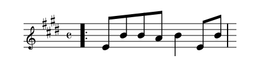

# StaffSharp

A music notation library for .NET that converts between musical formats - audio, MIDI, MusicXML, ABC notation, and SVG scores.

## What's this?

StaffSharp transforms music from one representation to another. The original goal was converting audio recordings (WAV files) into readable sheet music (SVG), but the architecture supports any-to-any conversion:

- **Audio** → MIDI, SVG
- **MusicXML** → SVG, MIDI, ABC
- **ABC notation** → SVG, MIDI
- **MIDI** → (planned)

## Early days

This is a very early stage project. The core architecture is in place with dual intermediate representations (performance timeline and notation score), but many features are incomplete or experimental. Expect breaking changes, missing functionality, and rough edges.

What's working:
- Monophonic audio analysis (Using pYIN, though there is a YIN implementation in there)
- MusicXML import
- ABC import
- MIDI export
- Basic score structures
- Score validation - the notation layer has validation logic that verifies it is structurally sound
- Rendering to SVG (Definitely a WIP!)  
  

What's not:
- Polyphonic audio analysis
- ABC export
- MIDI import
- MusicXML export
- Rendering decorations (trills, etc.) is very ropey
- Realistically even the things above you should expect bugs in!

## Structure

The codebase is organized into focused libraries:

- **StaffSharp.Core** - Core types (`NoteEvent`, `Frequency`, `Rational` timing)
- **StaffSharp.Audio** - DSP pipeline for audio analysis (pitch/onset detection)
- **StaffSharp.MusicXml** - MusicXML parsing (Exporting TODO)
- **StaffSharp.Abc** - ABC parsing and exporting
- **StaffSharp.Midi** - MIDI file generation (Parsing TODO)
- **StaffSharp.Svg** - SVG score rendering (very much WIP)
- **StaffSharp.Cli** - Command-line interface

## Architecture

StaffSharp uses two intermediate representations:

1. **Performance Timeline (IR1)** - Flat list of note events with rational timing. Used for audio sources.
2. **Notation Score (IR2)** - Hierarchical structure (parts/voices/measures) with symbolic durations. Required for all outputs.

Most importers go directly to IR2. Audio goes through IR1 first for analysis, then converts to IR2.

See [docs/architecture.md](docs/architecture.md) for details.

